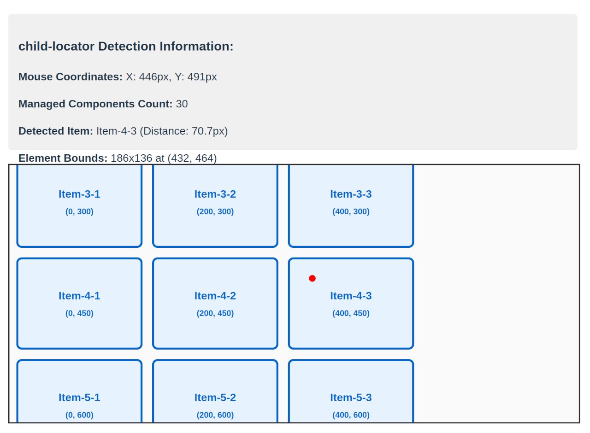

# child-locator

A React Hook for detecting child components at specific XY coordinates within a container element.

[](https://www.npmjs.com/package/child-locator)
[](https://www.repostatus.org/#wip)

## What is this?

If you're hesitant to manipulate delicate `Observers` to retrieve elements at specific positions displayed in the browser using React, the child-locator package might be useful.

This package identifies elements within a specified visible area of the page and makes it easy to retrieve the information held by those elements.
Since it's implemented using callback handlers, it can detect changes even when the layout shifts and elements change.

The detection position is not limited to absolute coordinates; it can also use various CSS units, enabling stable position detection for responsive design pages.



Features:

- XY Coordinate Detection: Precisely locate child components at specified coordinates
- CSS Unit Support: Coordinate values support px (number), `%`, `vw`, `vh`, `rem`, `em` (string) and other CSS units
- Real-time Monitoring: Automatically detects changes in child elements using `MutationObserver`, `ResizeObserver`, and `IntersectionObserver`

---

## Installation

```bash
npm install child-locator
```

## Basic Usage

To use child-locator, prepare as follows:

1. Setup the `ChildLocatorProvider` to enable child-locator to communicate information.
2. Next, implement trackable component whose location you want to detect. Extend this component into a detectable component using `withChildLocator`.
3. Use `useLocator` to set up the container component and handler.

When a component at the specified location is detected, the handler is called.

### 1. Setup Provider

First, setup your app with `ChildLocatorProvider`:

```tsx
import React from 'react';
import { ChildLocatorProvider } from 'child-locator';
import App from './App';

function Root() {
  return (
    <ChildLocatorProvider>
      <App />
    </ChildLocatorProvider>
  );
}
```

### 2. Create Trackable Components

Use `withChildLocator` to make components trackable:

```tsx
import React from 'react';
import { withChildLocator } from 'child-locator';
import type { WithChildLocatorProps } from 'child-locator';

// Base component (designed for your requirement)
const BaseChildItem = ({
  id,
  children,
}: {
  id: number;
  children: React.ReactNode;
}) => {
  return (
    <div data-testid={`child-${id}`}>
      {children}
    </div>
  );
};

// Make it trackable with child-locator
const ChildItem = withChildLocator(BaseChildItem);
```

### 3. Use Detection Hook

Use `useLocator` to detect components at specific coordinates:

```tsx
import React, { useRef } from 'react';
import { useLocator } from 'child-locator';
import type { DetectedComponent } from 'child-locator';

const ParentComponent = () => {
  // Makes refer the container
  const containerRef = useRef<HTMLDivElement>(null);

  useLocator(containerRef, {
    // Detection coordinates: CSS units supported: px, %, vw, vh, rem, em
    offset: { x: '50%', y: '30%' },
    // Detected callback:
    onDetect: (component: DetectedComponent) => {
      if (component.element) {
        console.log('Detected element:', component.element);
        console.log('Distance from target:', component.distanceFromOffset);
        console.log(
          'Component metadata:',
          component.component?.props._tetherMetadata
        );
      } else {
        console.log('No child elements at target coordinates');
      }
    },
    enabled: true,
  });

  // Place detection target items into the container
  return (
    <div
      ref={containerRef}
      style={{ width: 400, height: 300, position: 'relative' }}
    >
      <ChildItem id={1} tetherMetadata={{ type: 'grid-item', row: 1, col: 1 }}>
        Item 1
      </ChildItem>
      <ChildItem id={2} tetherMetadata={{ type: 'grid-item', row: 1, col: 2 }}>
        Item 2
      </ChildItem>
      <ChildItem id={3} tetherMetadata={{ type: 'grid-item', row: 2, col: 1 }}>
        Item 3
      </ChildItem>
    </div>
  );
};
```

---

## API Reference

### ChildLocatorProvider

Provider component that enables child component tracking. Must be placed at the root of your component tree.

```tsx
import { ChildLocatorProvider } from 'child-locator'

<ChildLocatorProvider>
  <YourApp />
</ChildLocatorProvider>
```

### withChildLocator

Higher-Order Component that makes a component trackable by child-locator.

```tsx
import { withChildLocator } from 'child-locator'
import type { WithChildLocatorProps } from 'child-locator'

const TrackableComponent = withChildLocator(YourBaseComponent)

// Usage with metadata
<TrackableComponent 
  tetherMetadata={{ id: 'item-1', type: 'grid-item' }}
  // ... other props
/>
```

#### WithChildLocatorProps

```tsx
interface WithChildLocatorProps {
  tetherMetadata?: ChildLocatorMetadata  // Optional metadata for tracking
}

interface ChildLocatorMetadata {
  [key: string]: unknown  // Flexible metadata object
}
```

### useLocator Hook

```tsx
useLocator(refTarget, options)
```

- `refTarget: RefObject<HTMLElement | null>` - Reference to the container element
- `options: UseLocatorOptions` - Configuration options

#### UseLocatorOptions

```tsx
interface UseLocatorOptions {
  offset: OffsetCoordinates;      // Target XY coordinates
  onDetect: (detected: DetectedComponent) => void;  // Detection callback
  enabled?: boolean;              // Enable/disable monitoring (default: true)
  scrollContainerRef?: RefObject<HTMLElement | null>; // Optional scroll container
}
```

#### OffsetCoordinates

```tsx
interface OffsetCoordinates {
  x: CSSUnitValue;  // X coordinate - supports px (number), %, vw, vh, rem, em (string)
  y: CSSUnitValue;  // Y coordinate - supports px (number), %, vw, vh, rem, em (string)
}

type CSSUnitValue = number | string;
```

#### DetectedComponent

```tsx
interface DetectedComponent {
  element?: HTMLElement;      // Detected HTML element (undefined if no children)
  component?: ReactElement;   // Associated React component with metadata
  bounds?: DOMRect;           // Element's bounding rectangle
  distanceFromOffset: number; // Euclidean distance from target coordinates
}
```

The `component` property contains the React element with props and metadata:

```tsx
// Access metadata
const metadata = detected.component?.props._tetherMetadata
```

---

## Examples

### CSS Unit Support

```tsx
import React, { useRef, useState } from 'react'
import { useLocator, ChildLocatorProvider, withChildLocator } from 'child-locator'

const TrackableItem = withChildLocator(({ children, style }: { 
  children: React.ReactNode; 
  style?: React.CSSProperties 
}) => (
  <div style={style}>{children}</div>
))

const CoordinateExamples: React.FC = () => {
  const containerRef = useRef<HTMLDivElement>(null);
  const [coordinateType, setCoordinateType] = useState<string>('percentage');
  
  // Different coordinate examples
  const coordinateExamples = {
    percentage: { x: '50%', y: '25%' },
    viewport: { x: '10vw', y: '15vh' },
    relative: { x: '5rem', y: '3em' },
    pixels: { x: 200, y: 150 }
  };
  
  useLocator(containerRef, {
    offset: coordinateExamples[coordinateType as keyof typeof coordinateExamples],
    onDetect: (component) => {
      if (component.element) {
        console.log(`Detected at ${coordinateType}:`, component.element)
        console.log('Metadata:', component.component?.props._tetherMetadata)
      }
    }
  })
  
  return (
    <ChildLocatorProvider>
      <div>
        <div>
          <h3>CSS Unit Examples</h3>
          <label>
            Coordinate Type:
            <select 
              value={coordinateType} 
              onChange={(e) => setCoordinateType(e.target.value)}>
              <option value="percentage">Percentage (50%, 25%)</option>
              <option value="viewport">Viewport (10vw, 15vh)</option>
              <option value="relative">Relative (5rem, 3em)</option>
              <option value="pixels">Pixels (200px, 150px)</option>
            </select>
          </label>
        </div>
        
        <div 
          ref={containerRef}
          style={{
            width: '600px',
            height: '400px',
            border: '2px solid #333',
            position: 'relative'
          }}>
          <TrackableItem 
            tetherMetadata={{ id: 'item-1', type: 'demo' }}
            style={{ position: 'absolute', left: 50, top: 50, width: 100, height: 80 }}
          >
            Item 1
          </TrackableItem>
          <TrackableItem 
            tetherMetadata={{ id: 'item-2', type: 'demo' }}
            style={{ position: 'absolute', left: 200, top: 150, width: 120, height: 90 }}
          >
            Item 2
          </TrackableItem>
        </div>
      </div>
    </ChildLocatorProvider>
  )
}
```

### Grid Layout Detection

```tsx
import React, { useRef, useState } from 'react'
import { useLocator, ChildLocatorProvider, withChildLocator } from 'child-locator'

const GridItem = withChildLocator(({ id }: { id: number }) => (
  <div 
    data-item-id={id}
    style={{
      padding: '20px',
      border: '1px solid #ddd',
      backgroundColor: '#f9f9f9',
      display: 'flex',
      alignItems: 'center',
      justifyContent: 'center'
    }}
  >
    Item {id}
  </div>
))

const GridComponent: React.FC = () => {
  const containerRef = useRef<HTMLDivElement>(null);
  const [targetCoords, setTargetCoords] = useState({ x: '25%', y: '50%' });
  
  useLocator(containerRef, {
    offset: targetCoords,
    onDetect: (component) => {
      if (component.element) {
        const itemId = component.element.getAttribute('data-item-id')
        const metadata = component.component?.props._tetherMetadata
        console.log(`Detected grid item: ${itemId}`)
        console.log(`Distance: ${component.distanceFromOffset.toFixed(1)}px`)
        console.log('Metadata:', metadata)
      }
    }
  })
  
  return (
    <ChildLocatorProvider>
      <div>
        <div>
          <label>
            X (CSS Unit): <input 
              type="text" 
              value={targetCoords.x}
              placeholder="e.g., 50%, 200px, 10vw"
              onChange={(e) => setTargetCoords(prev => ({ ...prev, x: e.target.value }))} />
          </label>
          <label>
            Y (CSS Unit): <input 
              type="text" 
              value={targetCoords.y}
              placeholder="e.g., 30%, 150px, 5vh"
              onChange={(e) => setTargetCoords(prev => ({ ...prev, y: e.target.value }))} />
          </label>
        </div>
        
        <div 
          ref={containerRef}
          style={{
            display: 'grid',
            gridTemplateColumns: 'repeat(3, 1fr)',
            gap: '10px',
            width: '400px',
            height: '300px'
          }}
        >
          {Array.from({ length: 9 }, (_, i) => (
            <GridItem 
              key={i} 
              id={i + 1}
              tetherMetadata={{ 
                itemId: i + 1, 
                row: Math.floor(i / 3) + 1, 
                col: (i % 3) + 1,
                type: 'grid-item'
              }}
            />
          ))}
        </div>
      </div>
    </ChildLocatorProvider>
  )
}
```

---

## Important Notes

### Coordinate System

- Flexible Units: Supports multiple CSS unit types:
  - Pixels (number): Direct pixel values (e.g., `100`, `250`)
  - Percentages (string): Relative to container size (e.g., `'50%'`, `'25%'`)
  - Viewport units (string): Relative to viewport (e.g., `'10vw'`, `'15vh'`)
  - Font-relative units (string): `'rem'` (root) and `'em'` (element) units
- Container-relative: Coordinates are relative to the container element's content area (excluding padding)
- Standard conventions: Follows web coordinate system (0,0 at top-left)
- Automatic conversion: CSS units are converted to pixels internally for precise detection
- Responsive design: Percentage and viewport units automatically adapt to size changes

### Limitations

- Direct Children Only: The child-locator can only detect direct child components of the component referenced by containerRef.
  For example, grandchild components of nested descendant components cannot be detected.

- Viewport Coordinate Constraint: When target coordinates are outside the browser viewport, detection behavior may differ for overlapping elements:
  - Within Viewport: Uses `document.elementFromPoint()` which respects CSS stacking context and z-index properly
  - Outside Viewport: Falls back to bounds-based detection using `getBoundingClientRect()`, which may return different results for overlapping elements due to different selection criteria (distance-based vs stacking context-based)
  
  This means that if you have overlapping child elements and specify coordinates outside the current viewport, the detected element might differ from what would be detected if the same coordinates were within the viewport.

### Performance Considerations

- The hook uses multiple observers (`MutationObserver`, `ResizeObserver`, `IntersectionObserver`) for comprehensive monitoring
- Detection callbacks are debounced to prevent excessive calls
- Observers are automatically cleaned up when the component unmounts or when disabled
- Components are tracked efficiently using internal WeakMap-based storage

----

## Discussions and Pull Requests

For discussions, please refer to the [GitHub Discussions page](https://github.com/kekyo/child-locator/discussions). We have currently stopped issue-based discussions.

Pull requests are welcome! Please submit them as diffs against the `develop` branch and squashed changes before send.

## License

Under MIT.
